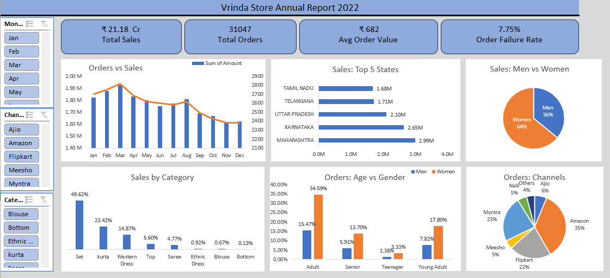

# 📊 Vrinda Store Sales Analysis Dashboard

## 🧾 Project Overview
This project analyzes sales data of Vrinda Store (~31,000 records) to uncover insights about customer behavior, sales trends, and business performance.

The goal is to help the business understand past performance (2022) and make better decisions to improve sales in the future.

---

## 🎯 Objective
- Analyze annual sales performance  
- Identify key customer segments  
- Understand sales trends and patterns  
- Discover top-performing channels, categories, and regions  

---

## 🛠️ Tools & Technologies
- Microsoft Excel  
- Power Query  
- Pivot Tables  
- Data Visualization  

---

## 🧹 Data Cleaning & Preparation
- Standardized inconsistent values in **Gender column** (M/W → Men/Women)  
- Created **Age Groups** using conditional logic  
- Extracted **Month** from Date column for trend analysis  
- Performed all transformations using **Power Query**  

---

## 📊 Key KPIs
- **Total Sales:** ₹21.18 Cr  
- **Total Orders:** 31,047  
- **Average Order Value:** ₹682  
- **Order Failure Rate:** 7.75%  

---

## 📈 Dashboard Features
- Interactive dashboard with **Slicers**  
- Sales vs Orders trend analysis  
- Category-wise performance  
- Customer segmentation (Age & Gender)  
- Channel contribution analysis  
- Regional (State-wise) insights  

---

## 🔍 Key Insights
- Women contributed ~64% of total sales, significantly higher than men  
- Adult and young adult age groups placed the highest number of orders  
- Amazon was the top-performing sales channel (~35% contribution)  
- Top states contributed a major portion of overall revenue  
- Certain product categories dominated sales while others had minimal impact  

---

## 💡 Business Recommendations
- Focus marketing efforts on **female customers**  
- Increase inventory for **high-performing categories**  
- Strengthen partnerships with top-performing channels like Amazon  
- Target high-sales states with region-specific campaigns  
- Improve operational efficiency to reduce **order failure rate**  

---

## 📸 Dashboard Preview

---

## 📂 Files Included
- `vrinda-sales-dashboard.xlsx` → Main Excel dashboard  
- `dashboard-screenshot.png` → Dashboard preview  
- `presentation.pdf` → Project carousel presentation (optional)  

---

## 🚀 Future Improvements
- Add year-over-year comparison  
- Build dashboard using Power BI  
- Automate data updates  

---

## 👩‍💻 Author
Kanchan Singh
